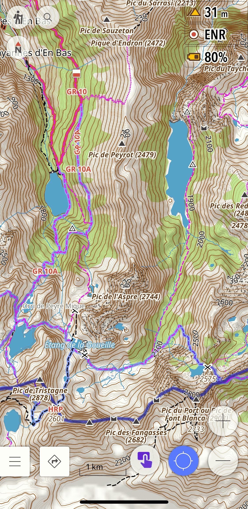
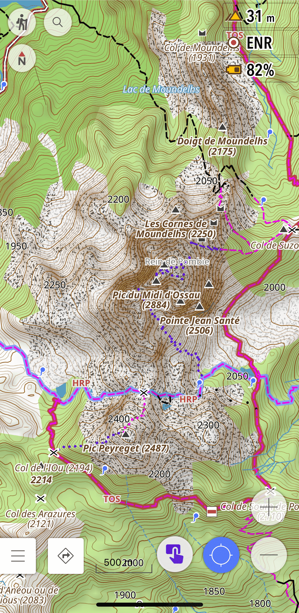
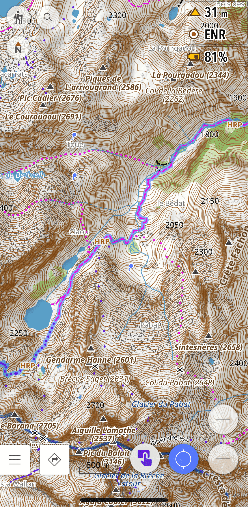
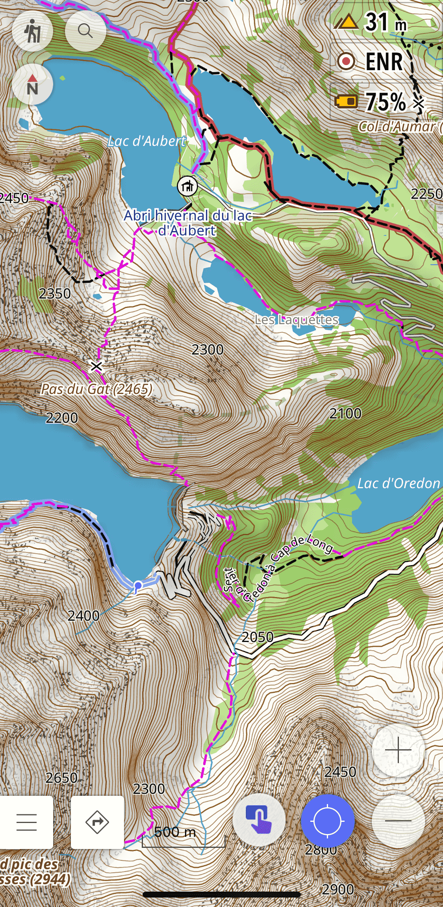
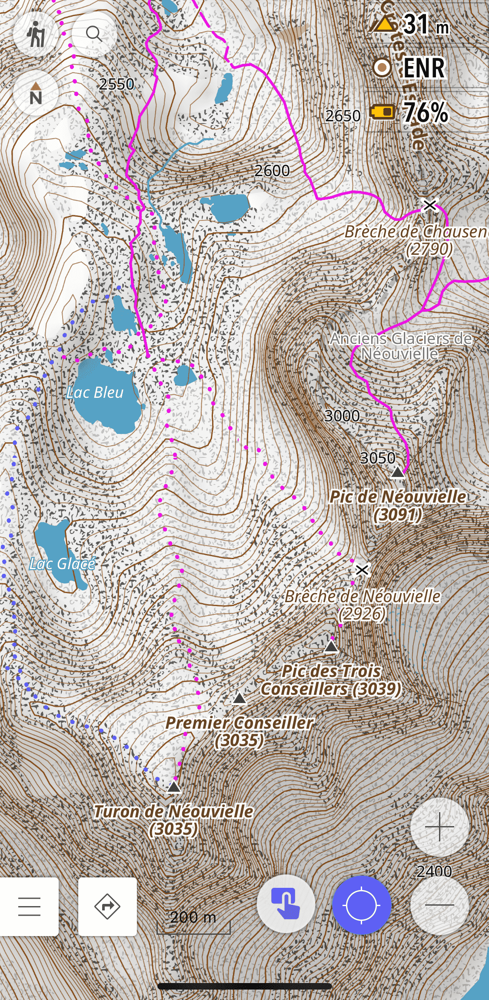
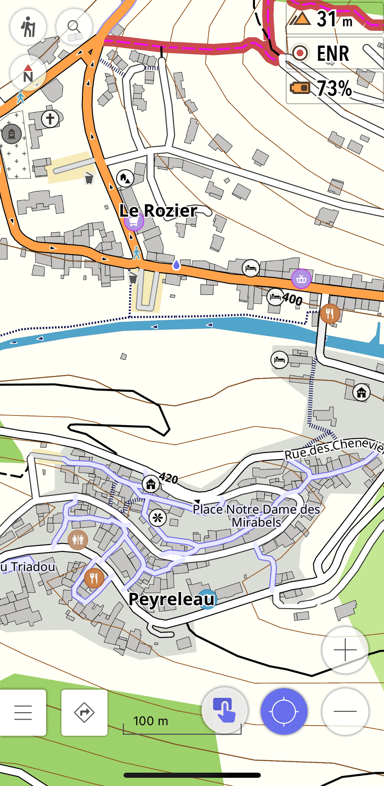

# Randonnée
 `Français`&emsp;[Español](README_ES.md)&emsp;[English](README_EN.md)

Pour la randonnée nous avons fait le constat qu'il fallait jongler entre plusieurs styles de carte pour avoir certaines informations.
Ce style est basé sur le style Topo d'OsmAnd, il améliore entre autres la lisibilité de la carte et une représentation du terrain plus réaliste.  

## Caractéristiques notables par rapport au style de carte topo standard :

- Sentiers et pistes plus épais. 
- Difficulté et visibilité des sentiers 
- POI utiles/intéressant mis en valeur
- Couleur des occupations du sol et de l’eau
- Réserves naturelles 
- Couleur opaque pour les itinéraires basés sur les symboles OSMC
- Réglages supplémentaires  

---

## Screenshots 

|  |  |  |
| :-------------: | :-------------: | :-------------: |
|  |  |  |

---

## Instructions d'installation
 

- [Instructions d'installation pour tous les profils, rendus et routages](https://github.com/OsmAnd-Rendering/.github/wiki/%F0%9F%87%AB%F0%9F%87%B7--T%C3%A9l%C3%A9chargement-et-Installation)
  

---

## Documentation
 

- [Améliorations du style](https://github.com/OsmAnd-Rendering/Hiking/wiki/%F0%9F%87%AB%F0%9F%87%B7-Fran%C3%A7ais-Am%C3%A9liorations-du-style-par-rapport-%C3%A0-Topo-d%E2%80%99OsmAnd) 
- [Légende](https://github.com/OsmAnd-Rendering/Hiking/wiki/%F0%9F%87%AB%F0%9F%87%B7-Fran%C3%A7ais-L%C3%A9gende) 
