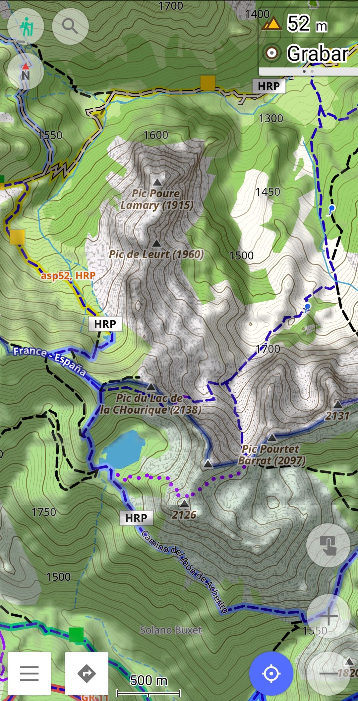
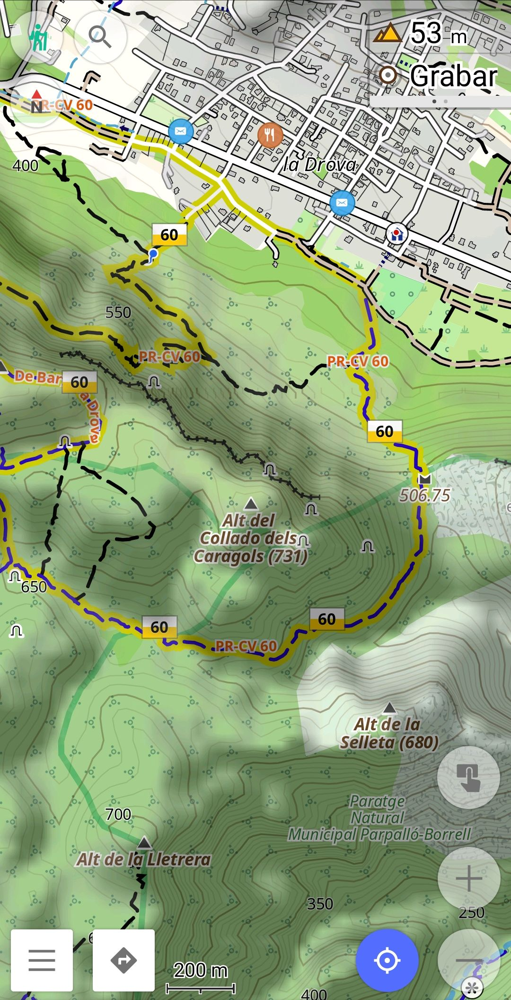
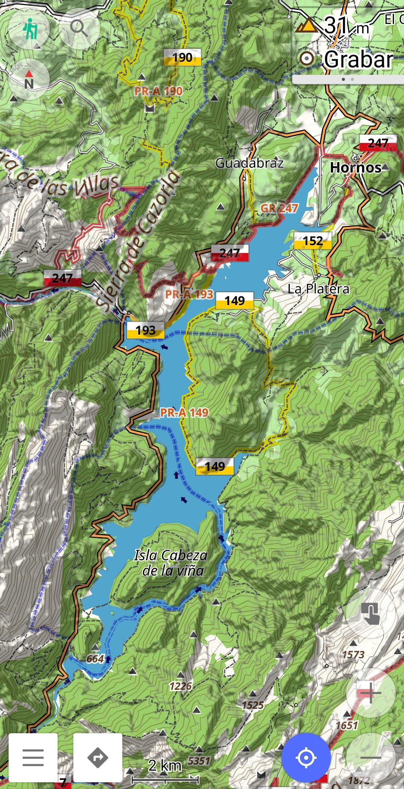

  `Español`&emsp;[English](README_EN.md)&emsp;[Français](README.md)

# Senderismo

Un estilo de mapa para OsmAnd, enfocado en la práctica del senderismo.
Este estilo está basado en el estilo Topo de OsmAnd y mejora, entre otras cosas, la visualización de las pistas y sendas, y la representación de algunos elementos importantes para los senderistas.  

##  Cambios notables con el estilo "Topo" incluido en Osmand:

- Caminos y pistas más gruesos.
- Colores según dificultad de los caminos
- Puntos de interés útiles/interesantes resaltados
- Colores de usos del suelo y del agua
- Reservas naturales
- Colores opacos para rutas basadas en símbolos OSMC
- Configuraciones adicionales  

##  Capturas de pantalla 

|  |  |  |
|:------------------------------------------------------:|:------------------------------------------------------:|:------------------------------------------------------:|

---

##  Instrucciones de instalación
 

- [IInstrucciones de instalación para todos los perfiles, renderizados y enrutamiento](https://github.com/OsmAnd-Rendering/.github/wiki/ES%E2%80%94Descargar-e-Instalar)
  

---

##  Documentación
 

- [Lista de mejoras](https://github.com/OsmAnd-Rendering/Hiking/wiki/%F0%9F%87%AB%F0%9F%87%B7-Fran%C3%A7ais-Am%C3%A9liorations-du-style-par-rapport-%C3%A0-Topo-d%E2%80%99OsmAnd) (Fr) 
- [Leyenda](https://github.com/OsmAnd-Rendering/Hiking/wiki/%F0%9F%87%AB%F0%9F%87%B7-Fran%C3%A7ais-L%C3%A9gende) (Fr) 

