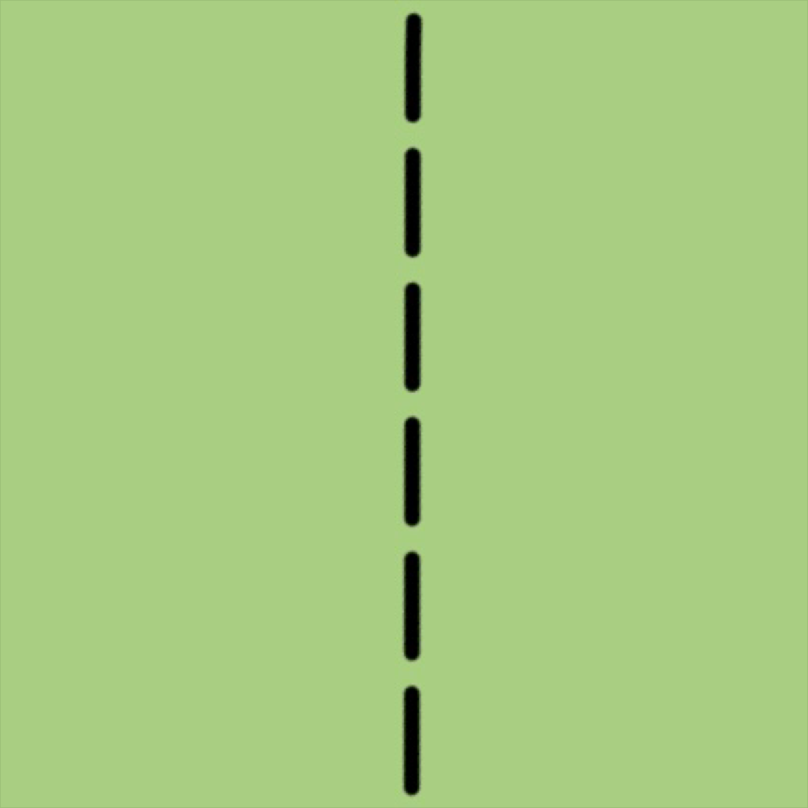
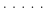
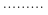
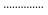
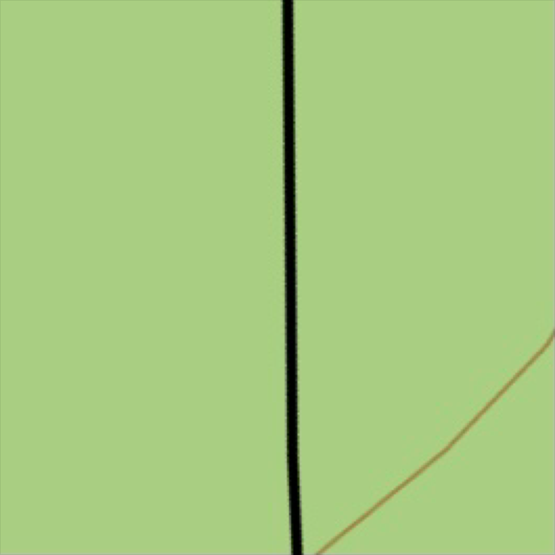
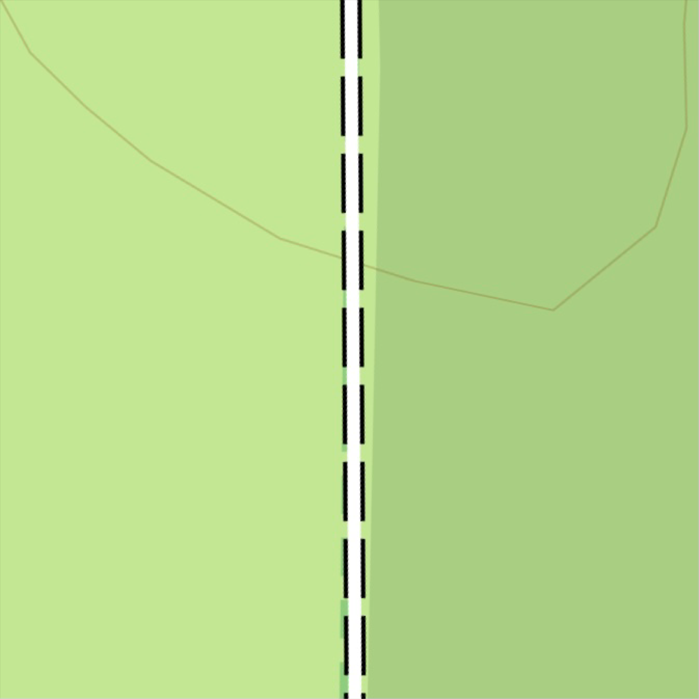
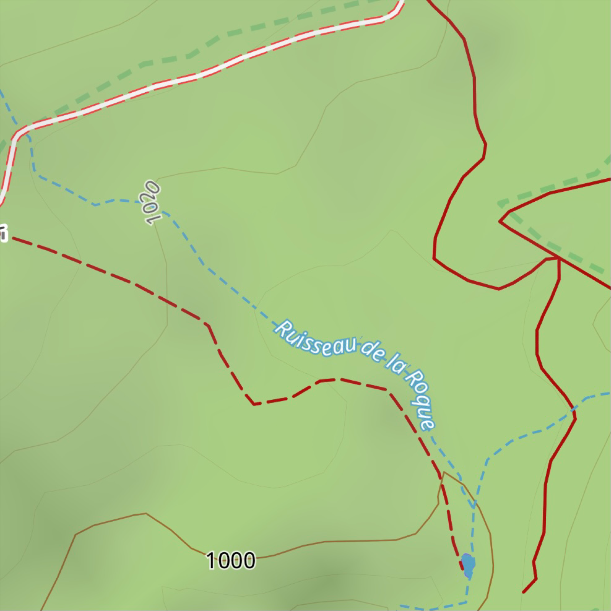

# Améliorations du rendu par rapport à Topo d’OsmAnd
## Sentiers, chemins, pistes agricoles et forestières type IGN
### Sentier type IGN France (`highway=path`) :
- Traits noir plus large
- Forme allongé
- Adoucit 
- Accès « non ou privé »
- Traits rouge-marron 

Difficulté et visibilité des sentiers :
Ces deux paramètres se combinent jusqu’à un certain zoom. Au zoom 18 (50 m) la visibilité est désactivée, il ne reste plus que la difficulté qui est affichée.
Couleur selon la difficulté « Échelle CAS » (`sac_scale=*`) :
- T1 noir discontinu
- T2 rose discontinu
- T3 rose continu
- T4 violet discontinu
- T5 violet continu
- T6 violet pointillé allongé

### Visibilité du sentier (`trail_visibility=*`) :
- Mauvais (`bad`) : pointillé
- Horrible (`horrible`) : pointillé plus espacé
- Non (`no`) : pointillé très espacé

|                                                                                                                      | T1          | T2          | T3          | T4          | T5          | T6          |
|----------------------------------------------------------------------------------------------------------------------|:-----------:|:-----------:|:-----------:|:-----------:|:-----------:|:-----------:|
| `trail_visibility=no`                                                                                                |  |  |  |  |  |  |
| `trail_visibility=horrible`                                                                                          |  |  |  |  |  |  |
| `trail_visibility=bad`                                                                                               |  |  |  |  |  |  |
| `trail_visibility=intermediate`/`trail_visibility=good`/`trail_visibility=excellent` and `trail_visibility` disabled |  |  |  |  |  |  |
| `trail_visibility=*` and `sac_scale=*` (CAS) disabled                                                                |  |  |  |  |  |  |

### Chemin/Chemin agricole/piste forestière type IGN France (`highway=track`) :

| Légende                                                                                                         | Image                    |
|-----------------------------------------------------------------------------------------------------------------|--------------------------|
| Trait noir plein pour pour les grades 3, 4 et 5 (`tracktype=grade3`/`grade4`/`grade5`)                          |  |
| Trait blanc plein avec trait noir discontinu sur les côtés pour les grades 1 et 2 (`tracktype=grade1`/`grade2`) |    |

### Accès « non ou privé » (`acces=private`/`no`) :

- Traits rouge-marron pour les grades 3-4-5 (`tracktype=grade3`/`grade4`/`grade5`)
- Trait blanc plein avec trait rouge discontinu sur les côtes pour les grades 1-2 (`tracktype=grade1`/`grade2`)

### Options désactivables dans « masquer » :
- Symboles « NR » des réserves naturelles (shader nr2)
- Couleur des réserves naturelles
- Visibilité des sentiers (`trail_visibility=*`)
- Symboles de l’occupation du sol (shader)

## POI pré-activé :
- **Violet** : alimentaire (supérette, supermarché, boucherie, boulangerie, etc.)
- **Orange** : loisirs (restaurant, bar, café, etc.)
- **Bleu** : utilitaire (poste, police, parking)
- **Gris** : transport (gare routière, train, distributeur de billets/banque et cimetière)
- **Rouge** : santé (docteur, Hopital, véto, dentiste, etc.)
- **Vert** : pharmacie
- **Marron** : hygiène (toilette et douche publique)
- **Blanc** : pendant la rando (refuges, abris, cabanes, gîtes étapes, hôtels, point de vue, panneaux d’information, etc.)

## Occupation du sol :
- Couleur changée (bois, prairie, broussailles, pâturages, etc.)
- Image Zone rocheuses plus foncé (shader)
- Image pierrier plus foncé (shader)
- Couleur des bâtiments plus claire
- Couleur des surface des villes/villages/hameaux plus claire
- Symboles (shader)

## Courbe de niveau :
- Épaisseur des traits réduits au zoom 11-12-13
- Couleur corrigé pour le marron clair
- Couleur ajouté (Orange et noir)
- Réglage « Rando » supplémentaire pour la densité (type IGN France)
- Réglage « Rando » supplémentaire pour l’épaisseur (type IGN France)
- Suppression de petits traits inutiles

## Texte :
- Texte marrons plus grand et fin ainsi qu’un halo blanc peu opaque pour les montagnes, crêtes et couloirs
- Texte vert plus grand et fin ainsi qu’un halo blanc peu opaque pour les vallées et gorges
- Taille du texte des villages , hameaux, lieux-dits adaptés en fonction du zoom
- Taille du texte des sommets, cols, mountain pass adaptés en fonction du zoom
- Taille du texte des courbes de niveaux adaptés en fonction du zoom
- Texte des pierriers
- Texte des routes principales, secondaires, tertiaires plus petit et adapté selon le zoom
- Texte arrêts de bus/trains à partir d’un certain zoom

## Icône :
- Tour
- Antenne radio 
- Éolienne
- Transformateur électrique
- Table de pique-nique
- Parking
- POI (couleurs selon la catégorie)

## Itinéraire :
- Couleur opaque pour les itinéraires basés sur les symboles OSMC

## Affichage selon le zoom :
- **Zoom 7** – 100 km
  - Régions
- **Zoom 10** – 10 km
  - Villages
- **Zoom 11** – 5 km
  - Icône des sommets principaux
- **Zoom 12** – 2 km
  - Sentiers traits très fin (sentier/piste/route tertiaire)
  - Hameaux/lieux-dits
  - Icône sommet, col et mountain_pass + Altitude
  - Texte vallées et crêtes
- **Zoom 13** – 1 km
  - Sentiers traits (sentier/piste/route tertiaire), vue des hameaux/lieux-dits
  - visibilités des sentiers
  - difficulté des sentiers
  - Texte courbe de niveau des 100 m sur la courbe
  - Icône des refuges/abris
  - Texte + altitudes des sommets
- **Zoom 14** – 500 m
  - Texte des refuges
  - Icônes de l’occupation du sol
  - Texte courbe de niveau 100 et 50 m à l’horizontale
  - Icône éolienne
  - Texte des pierriers
- **Zoom 15** – 200 m
  - Texte courbe de niveau 100 et 50 m à l’horizontale
  - Texte des mountain_pass + l’altitude
  - Icône des supérettes, bar/resto, etc
  - Icône occupation du sol
- **Zoom 16** – 200 m
  - Texte courbe de niveau 100, 50, 20 et 10 m sur la courbe en gras
  - Icône éolienne plus grosse
  - Texte couloir (montagne)
  - Texte des sources
  - Altitudes panneaux d’information
  - Icônes entourées d’un rond blanc pour les POI repérant/intéressant pendant la randonnée (ex : ruines, grottes, mines, antennes, etc.)
- **Zoom 17** – 100 m
  - Courbe de niveau en trait plein (meilleure visibilité dans les zones rocheuses)
  - Texte des cols + l’altitude
  - Texte des panneaux d’information + altitudes
- **Zoom 18** – 50 m
  - Courbes de niveau plus épaisse
  - Icône pylônes électriques réaliste
  - Texte arrêt de bus/trains
  - Désactivation de la visibilité des sentiers (seule la difficulté est visible T2/T3/T4/T5/T6)
- **Zoom 19** – 20 m
- Activation de certains textes dans les villes/villages/hameaux