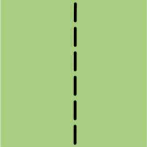
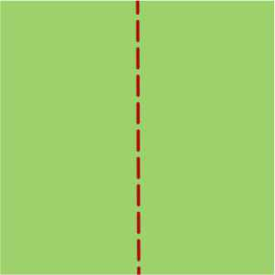
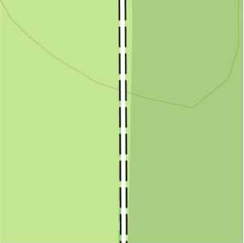
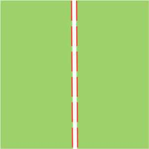
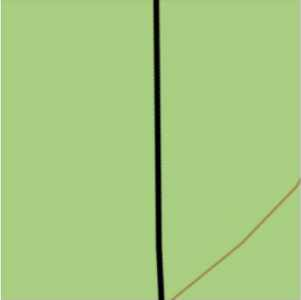
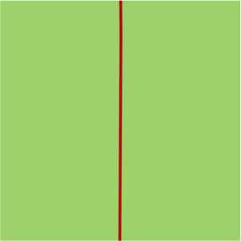

# Légende
## Sentiers, chemins, pistes agricoles et forestières type IGN

### Sentier (`highway=path`) :
| Légende             | Apparence                                                                   |
|---------------------|-----------------------------------------------------------------------------|
| **Normal** - Traits noirs plus large - Forme allongé - Adouci  |      |
| **Accès « non ou privé »** - Traits rouge-marron                    |  |

## Difficulté et visibilité des sentiers :
Ces deux paramètres se combinent jusqu’à un certain zoom. Au zoom 18 (50 m) la visibilité est désactivée, il ne reste plus que la difficulté qui est affichée.

### Couleur selon la difficulté « Échelle CAS » (`sac_scale=*`) :
- T1 noir discontinu
- T2 rose discontinu
- T3 rose continu
- T4 violet discontinu
- T5 violet continu
- T6 violet pointillé allongé

### Visibilité du sentier (`trail_visibility=*`) :
- Mauvais (`bad`) : pointillé
- Horrible (`horrible`) : pointillés plus espacés
- Non (`no`) : pointillé très espacés

### Chemin/Chemin agricole/piste forestière (`highway=track`) :
#### Grades 1 et 2 (`tracktype=grade1`/`grade2`)
| Légende                                                                                                         | Apparence                       |
|-----------------------------------------------------------------------------------------------------------------|:-------------------------------:|
| **Normal** - Trait blanc plein avec traitillé noir sur les côtés |                                               |
| **Accès « non ou privé »** (`acces=private`/`no`) - Traits rouge-marron |                                            |

#### Grades 3, 4 et 5 (`tracktype=grade3`/`grade4`/`grade5`)
| Légende                                                                                                         | Apparence                       |
|-----------------------------------------------------------------------------------------------------------------|:-------------------------------:|
| **Normal** - Trait noir plein |                                                                                       |
| **Accès « non ou privé »** (`acces=private`/`no`) - Trait blanc plein avec trait rouge discontinu sur les côtés |  |

