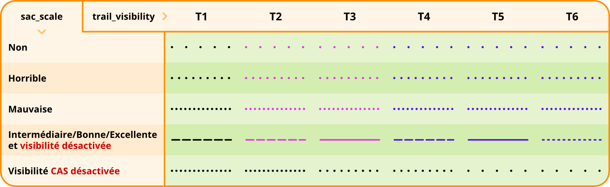

# Améliorations du rendu par rapport à Topo d’OsmAnd
## Sentiers, chemins, pistes agricoles et forestières type IGN

### Sentier type IGN France (`highway=path`) :
| Légende             | Apparence                                                                   |
|---------------------|-----------------------------------------------------------------------------|
| **Normal** - Traits noirs plus large - Forme allongé - Adouci  |      |
| **Accès « non ou privé »** - Traits rouge-marron                    |  |

## Difficulté et visibilité des sentiers :
Ces deux paramètres se combinent jusqu’à un certain zoom. Au zoom 18 (50 m) la visibilité est désactivée, il ne reste plus que la difficulté qui est affichée.

### Couleur selon la difficulté « Échelle CAS » (`sac_scale=*`) :
- T1 noir discontinu
- T2 rose discontinu
- T3 rose continu
- T4 violet discontinu
- T5 violet continu
- T6 violet pointillé allongé

### Visibilité du sentier (`trail_visibility=*`) :
- Mauvais (`bad`) : pointillé
- Horrible (`horrible`) : pointillés plus espacés
- Non (`no`) : pointillé très espacés

### Chemin/Chemin agricole/piste forestière type IGN France (`highway=track`) :
#### Grades 1 et 2 (`tracktype=grade1`/`grade2`)
| Légende                                                                                                         | Apparence                       |
|-----------------------------------------------------------------------------------------------------------------|:-------------------------------:|
| **Normal** - Trait blanc plein avec traitillé noir sur les côtés |                                               |
| **Accès « non ou privé »** (`acces=private`/`no`) - Traits rouge-marron |                                            |

#### Grades 3, 4 et 5 (`tracktype=grade3`/`grade4`/`grade5`)
| Légende                                                                                                         | Apparence                       |
|-----------------------------------------------------------------------------------------------------------------|:-------------------------------:|
| **Normal** - Trait noir plein |                                                                                       |
| **Accès « non ou privé »** (`acces=private`/`no`) - Trait blanc plein avec trait rouge discontinu sur les côtés |  |

### Options désactivables dans « masquer » :
- Symboles « NR » des réserves naturelles (shader nr2)
- Couleur des réserves naturelles
- Visibilité des sentiers (`trail_visibility=*`)
- Symboles de l’occupation du sol (shader)

## POI pré-activé :
- [x] **Violet** : alimentaire (supérette, supermarché, boucherie, boulangerie, etc.)
- [x] **Orange** : loisirs (restaurant, bar, café, etc.)
- [x] **Bleu** : utilitaire (poste, police, parking)
- [x] **Gris** : transport (gare routière, train, distributeur de billets/banque et cimetière)
- [x] **Rouge** : santé (docteur, hôpital, véto, dentiste, etc.)
- [x] **Vert** : pharmacie
- [x] **Marron** : hygiène (toilette et douche publique)
- [x] **Blanc** : pendant la rando (refuges, abris, cabanes, gîtes étapes, hôtels, point de vue, panneaux d’information, etc.)

## Occupation du sol :
- Couleur changée (bois, prairie, broussailles, pâturages, etc.)
- Image Zone rocheuses plus foncé (shader)
- Image pierrier plus foncé (shader)
- Couleur des bâtiments plus claire
- Couleur des surfaces des villes/villages/hameaux plus claire
- Symboles (shader)

## Courbe de niveau :
- Épaisseur des traits réduits au zoom 11-12-13
- Couleur corrigée pour le marron clair
- Couleur ajoutée (orange et noir)
- Réglage « Rando » supplémentaire pour la densité (type IGN France)
- Réglage « Rando » supplémentaire pour l’épaisseur (type IGN France)
- Suppression de petits traits inutiles

## Texte :
- Texte marron plus grand et fin ainsi qu’un halo blanc peu opaque pour les montagnes, crêtes et couloirs
- Texte vert plus grand et fin ainsi qu’un halo blanc peu opaque pour les vallées et gorges
- Taille du texte des villages, hameaux, lieux-dits adaptés en fonction du zoom
- Taille du texte des sommets, cols, mountain pass adaptés en fonction du zoom
- Taille du texte des courbes de niveaux adaptés en fonction du zoom
- Texte des pierriers
- Texte des routes principales, secondaires, tertiaires plus petit et adapté selon le zoom
- Texte arrêts de bus/trains à partir d’un certain zoom

## Icône :
- Tour
- Antenne radio 
- Éolienne
- Transformateur électrique
- Table de pique-nique
- Parking
- POI (couleurs selon la catégorie)

## Itinéraire :
- Couleur opaque pour les itinéraires basés sur les symboles OSMC

## Affichage selon le zoom :
- **Zoom 7** – 100 km
  - Régions
- **Zoom 10** – 10 km
  - Villages
- **Zoom 11** – 5 km
  - Icône des sommets principaux
- **Zoom 12** – 2 km
  - Sentiers traits très fin (sentier/piste/route tertiaire)
  - Hameaux/lieux-dits
  - Icône sommet, col et mountain_pass + Altitude
  - Texte vallées et crêtes
- **Zoom 13** – 1 km
  - Sentiers traits (sentier/piste/route tertiaire), vue des hameaux/lieux-dits
  - visibilités des sentiers
  - difficulté des sentiers
  - Texte courbe de niveau des 100 m sur la courbe
  - Icône des refuges/abris
  - Texte + altitudes des sommets
- **Zoom 14** – 500 m
  - Texte des refuges
  - Icônes de l’occupation du sol
  - Texte courbe de niveau 100 et 50 m à l’horizontale
  - Icône éolienne
  - Texte des pierriers
- **Zoom 15** – 200 m
  - Texte courbe de niveau 100 et 50 m à l’horizontale
  - Texte des mountain_pass + l’altitude
  - Icône des supérettes, bar/resto, etc
  - Icône occupation du sol
- **Zoom 16** – 200 m
  - Texte courbe de niveau 100, 50, 20 et 10 m sur la courbe en gras
  - Icône éolienne plus grosse
  - Texte couloir (montagne)
  - Texte des sources
  - Altitudes panneaux d’information
  - Icônes entourées d’un rond blanc pour les POI repérant/intéressant pendant la randonnée (ex : ruines, grottes, mines, antennes, etc.)
- **Zoom 17** – 100 m
  - Courbe de niveau en trait plein (meilleure visibilité dans les zones rocheuses)
  - Texte des cols + l’altitude
  - Texte des panneaux d’information + altitudes
- **Zoom 18** – 50 m
  - Courbes de niveau plus épaisse
  - Icône pylônes électriques réaliste
  - Texte arrêt de bus/trains
  - Désactivation de la visibilité des sentiers (seule la difficulté est visible T2/T3/T4/T5/T6)
- **Zoom 19** – 20 m
  - Activation de certains textes dans les villes/villages/hameaux
